# Exercicis

## Anàlisi en viu

### ICMP

Kali ja té instal·lat Wireshark. Si esteu utilitzant un Ubuntu Desktop, instal·la i configura Wireshark.

Posa en marxa la captura de paquets de Wireshark sobre la targeta de xarxa del teu Kali amb adaptador pont:

- **Adreça IP:** `192.168.c.x/24` on `c` és `2` per 2n A i `4` per 2n B, i `x` el teu número de llista.
- **Porta d'enllaç:** `192.168.c.254`
- **DNS:** `8.8.8.8`

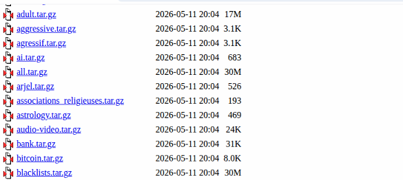


Obre una consola i executa un `ping` a algun servei o al router de l’escola. Deixa que faci quatre o cinc peticions i atura la comanda (el `ping` per defecte a Linux no para d’enviar paquets).


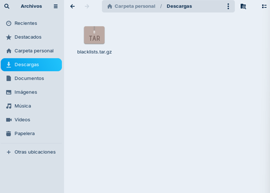


Atura la captura de paquets. Veuràs que s’ha capturat un munt de paquets, sense discriminar, però només volem veure els que fan referència al ping que hem fet.

Per fer-ho, apliquem un filtre de visualització, que permet triar el que volem veure de tot el que s’ha capturat.

Dintre aquest protocol trobem els tipus `echo request/reply`, que són els que fa servir la comanda `ping`.

Escriu la paraula `icmp` a **Filter:**.

#### Preguntes

- Quin número de tipus de ICMP té la petició d’eco i quin la resposta d’eco?
- Com ho veus?
- Incorpora una captura de pantalla on es vegi el tipus de ICMP.


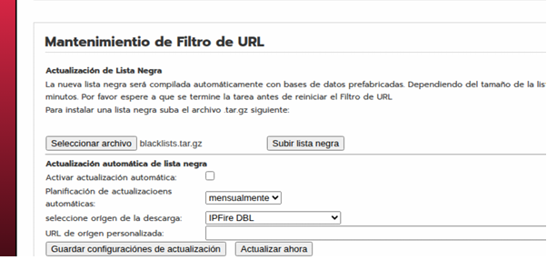

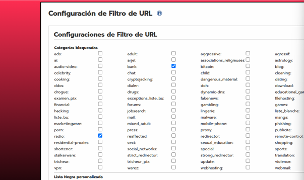

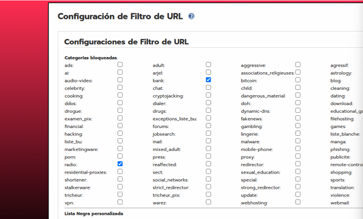


A les opcions avançades de la targeta activa el mode promiscu amb l’opció **Permetre-ho tot**.

```text
promiscous_mode

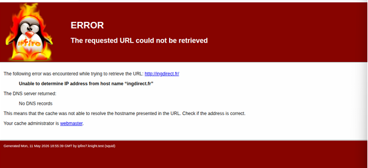

## Captura i anàlisi de trànsit de xarxa

## Captura de trànsit

Fes una captura de trànsit mentre navegues des de la màquina física.

### Quin trànsit pots veure relacionat amb el teu PC?


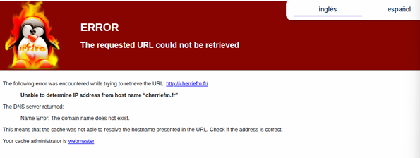

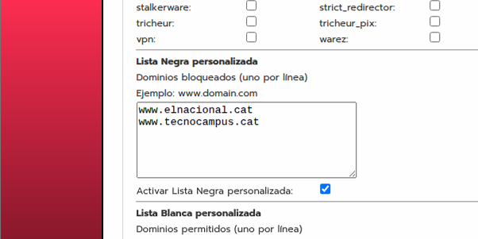

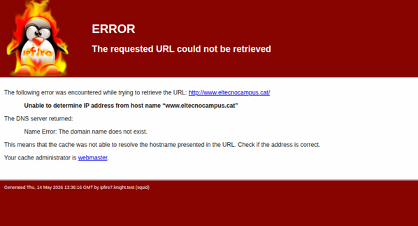


## DNS

Centreu l’atenció en el protocol DNS posant un filtre de visualització (protocol DNS i adreça IP d’origen o destí la de la nostra màquina).

### Veieu la petició de resolució que fa el vostre client?

Comproveu que la resposta del servidor conté l’adreça IP de `www.xtec.cat` (comproveu amb la comanda `nslookup` quina és).

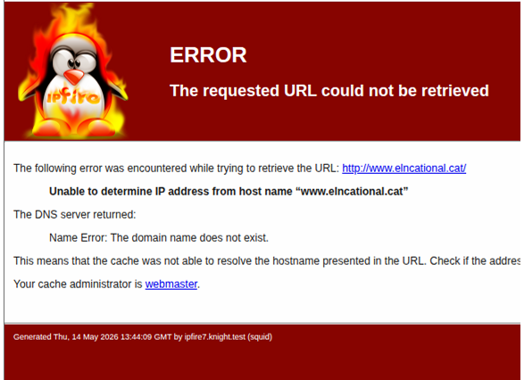

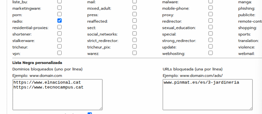

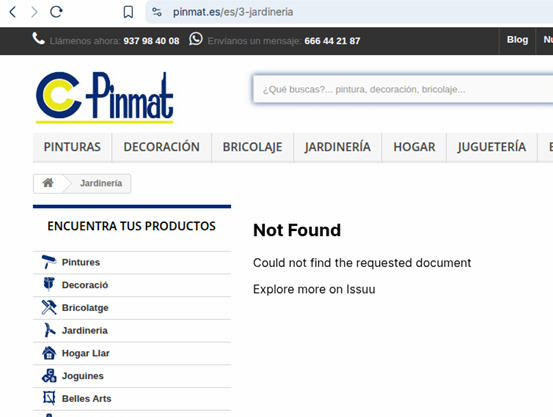

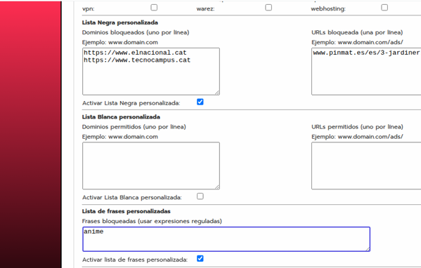
## ARP

Ara mirarem el protocol ARP, que serveix als nostres equips per demanar per broadcast qui té una adreça IP determinada i obtenir la seva adreça MAC.

### Preguntes

- Quina adreça MAC té el gateway de la xarxa?
- Quin és el fabricant de la seva NIC?

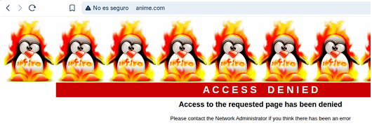

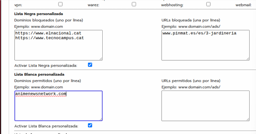


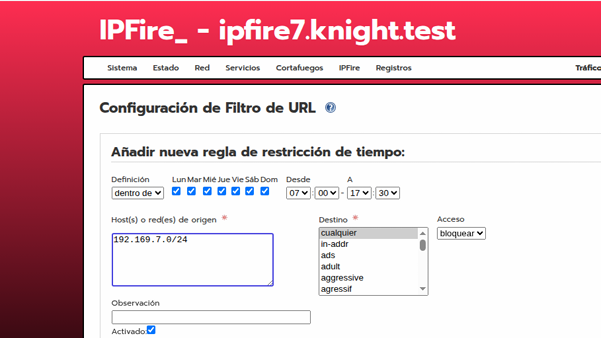

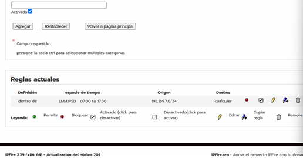


## Anàlisi de captura d'arxius

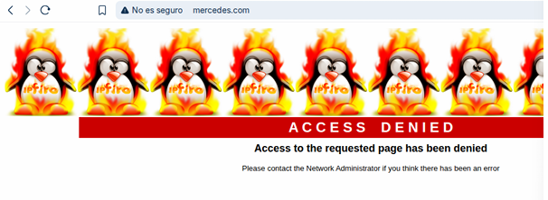


Carrega la captura `captura1.pcapng` que teniu a la carpeta `files` d’aquest repositori.

## Aconsegueix trobar la següent informació

### 1. Protocol ARP

Pots saber quina adreça MAC té l’equip amb adreça `192.168.1.1`?

Fes un filtre per veure només els paquets d’aquesta adreça del protocol ARP.


**Resposta:**

---

### 2. Sessió FTP

- Quin és el password de l’usuari que inicia sessió?
- Quin nom té el fitxer que es descarrega del servidor?


### 3. Sessió Telnet

- Pots veure el que veia l’usuari en connectar al telnet?
- Explica què és.
- Quins caràcters composen la nau espacial petita? (Posar-los com a resposta).
- A quin domini pertany l’adreça on ens connectem?


### 4. Sessió SSH

- Pots saber a quin domini pertany l’adreça del servidor?


- Pots veure el contingut de les dades de la sessió?


### 5. Correu electrònic

Ara carrega l’arxiu `captura2.pcapng` que també teniu al repositori.

Troba el missatge que s’ha enviat amb el protocol de correu sortint.


